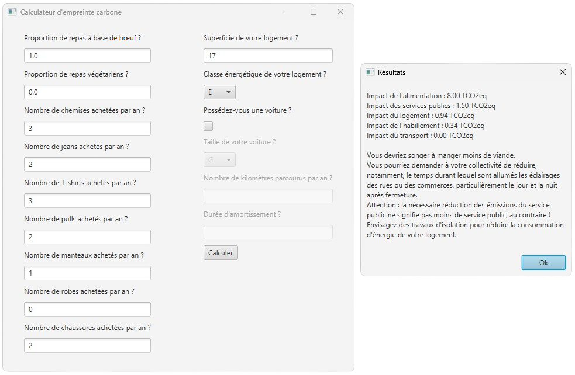

# EmpreinteCarbone


Ce projet est un calculateur d'empreinte carbone. Il quantifie les émissions de gaz à effet de serre d'un individu en
tonne éq. CO2 en fonction de son mode de vie.

## Versions

- Java `19.0.1`
- JUnit `5.8.1`
- JavaFX `SDK 19` ([installation](https://openjfx.io/openjfx-docs/#introduction))

## Compilation

- `Main.java` permet d'exécuter le programme dans sa version console.
- `Utilisateur.java` donne un exemple de lecture depuis un fichier texte.
- `GUI.java` permet d'exécuter le programme dans sa version graphique.

### Format d'un fichier texte

Ligne par ligne :

- Taux de repas à base de bœuf (de 0.0 à 1.0)
- Taux de repas végétariens
- Nombre de chemises achetées par an
- Nombre de jeans achetés par an
- Nombre de T-shirts achetés par an
- Nombre de pulls achetés par an
- Nombre de manteaux achetés par an
- Nombre de robes achetées par an
- Nombre de chaussures achetées par an
- Nombre de logements possédés
    - Pour chaque logement :
        - Superficie
        - Classe énergétique (de A à G)
- Nombre de voitures possédées
    - Pour chaque voiture :
        - Taille (Petite ou Grande)
        - Nombre de km parcourus par an
        - Durée d'amortissement

#### Exemple : utilisateur_txt/utilisateur2.txt

```
0.1  
0.8  
4  
2  
5  
5  
1  
0  
1  
3  
200  
A  
120  
B  
19  
D  
2  
G  
2102  
8  
P  
232  
2
```

#### Sortie associée

```
Impact du transport : 2.78 TCO2eq
Impact de l'alimentation : 1.68 TCO2eq
Impact des services publics : 1.50 TCO2eq
Impact du logement : 1.20 TCO2eq
Impact de l'habillement : 0.39 TCO2eq

Total : 7.55 TCO2eq
Empreinte carbone moyenne d'un Français en 2018 : 11 TCO2eq

Vos recommandations :
- Essayez de changer de voiture pour un plus petit modèle.
- Tout en minimisant votre consommation de viande, vous pourriez vous orienter vers des produits locaux.
- Vous pourriez demander à votre collectivité de réduire, notamment, le temps durant lequel sont allumés les éclairages des rues ou des commerces, particulièrement le jour et la nuit après fermeture.
Attention : la nécessaire réduction des émissions du service public ne signifie pas moins de service public, au contraire !
```

### GUI

